# CookBook
Homework assignment for **Android-based software development** course at the *Budapest University of Technology and Economics*.

## Motivations

 I wanted to create an application for storing and sharing recipes in a cloud backed up system. The idea came to me after I broke one of my previous phones, and had lost all of my non-backed-up recipes, so I wanted a safer way for storing them. Then the idea came to extend it, so users can also share their recipes with others.

## Main Functions

- Registration and authentication
- Storage and visualisation of own and other's recipes
- Creation of recipes when the user is authenticated, saved both locally and in remote database
- "Liking" recipes each time the user makes them
- Deletion of the user's own recipes
- Pop-up windows to validate user input
- Sending notification to all users once a recipe reaches a certain amount of likes

## Explored Technologies

- Activity and Fragment classes
    - displaying different views
- Dialog Fragment
    - validation of user input
- Navigation Drawer Activity
    - handling of created fragments
- Livedata
    - displaying up-to-date data
- Firebase
    - registration and authentication
- Firestore
    - remote data storage
- Glide
    - displaying images stored online
- Firebase Messaging
    - push notifications
- Room API
    - masking SQLite requests
- Kotlinx Coroutines
    - asynchronous messages
- Retrofit
    - communication over HTTP
- Service
- Bundle
    - data transfer between fragments
- Parcelable
- ViewBinding
- Toast messages
- Extension functions
- Intent
- Staggered Grid Layout Manager
- Notification Manager

## Presentational images
- Opening fragment of application, Own Recipes Fragment. 
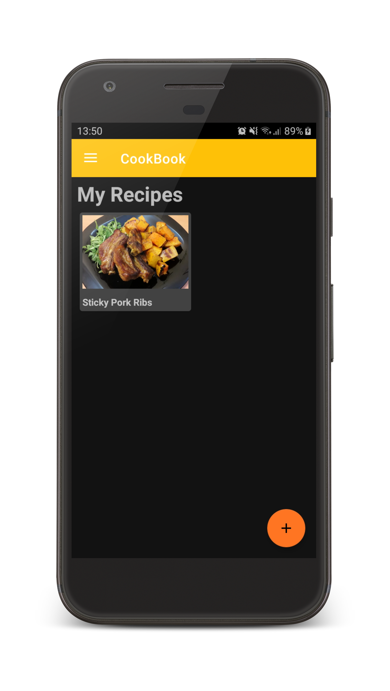
- Navigation Drawer
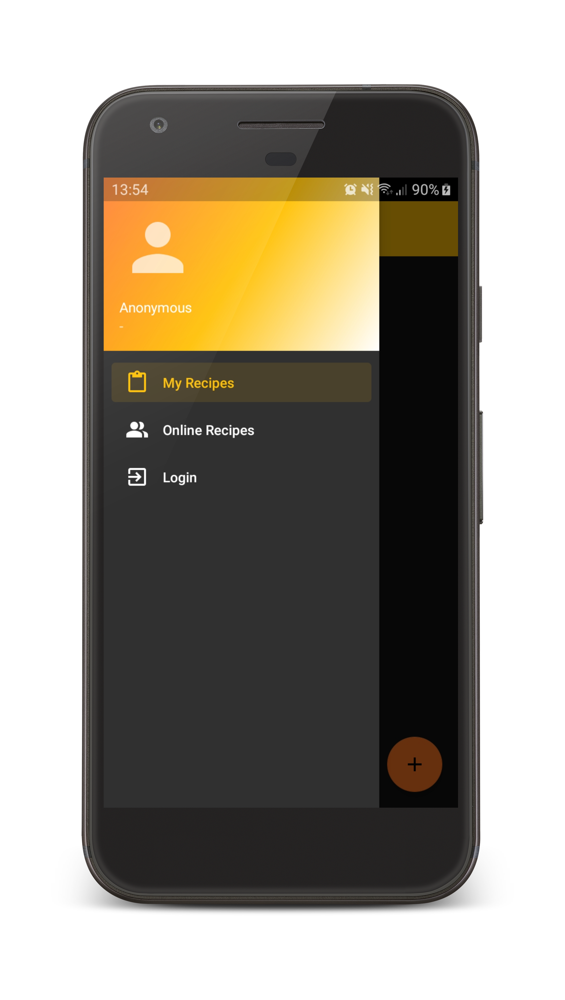
- Online Recipes Fragment
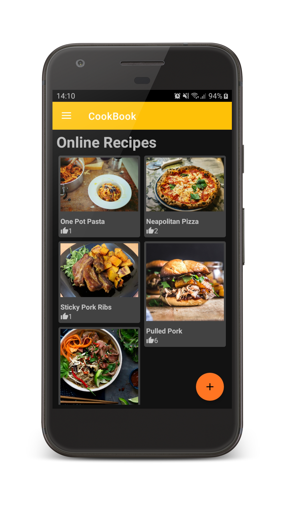
- Opened Recipe Fragment
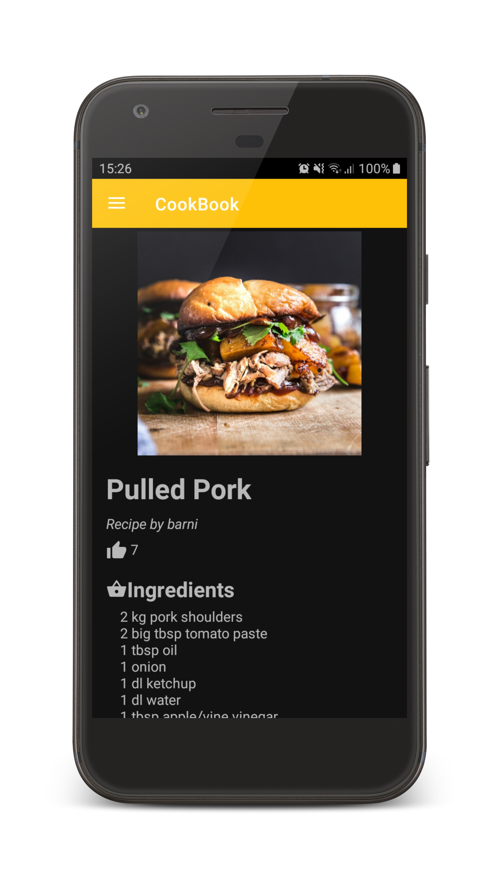
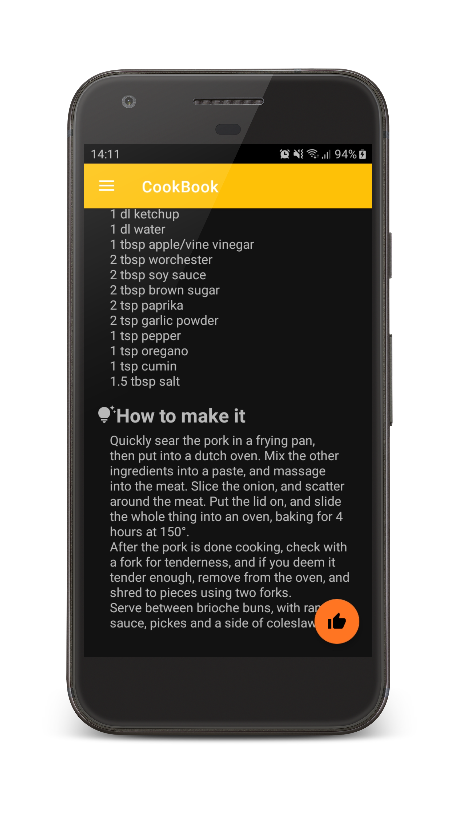
- Navigation Drawer with Authenticated Account
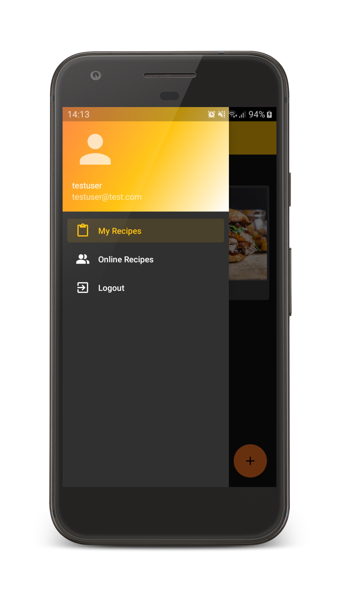
- Creating New Recipe
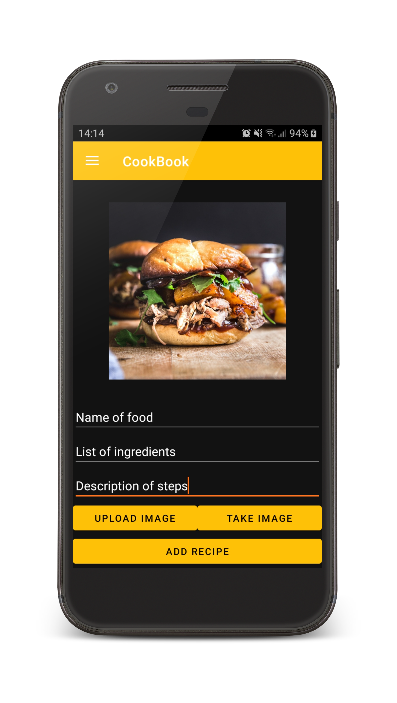
- Created Recipe View
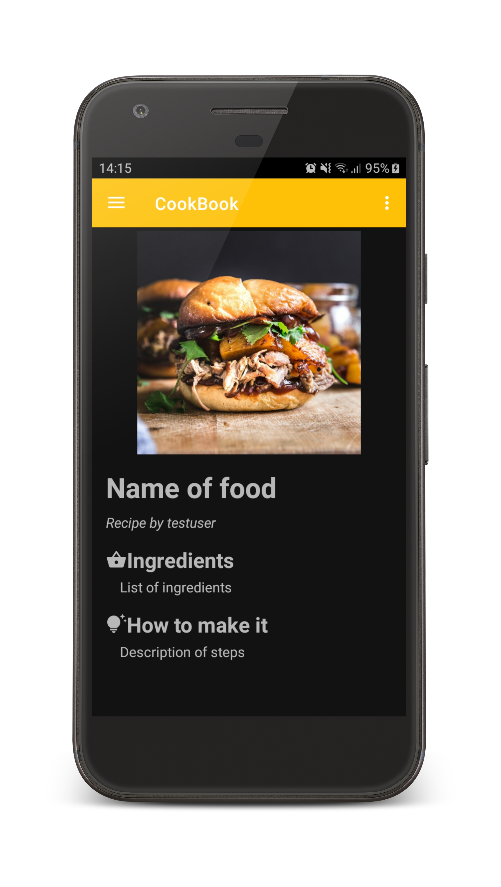
- Deleting Recipe Options
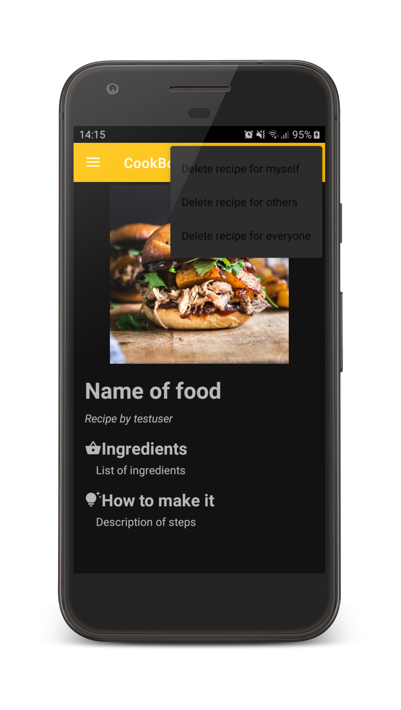
- Deleting Recipe Validation Popup
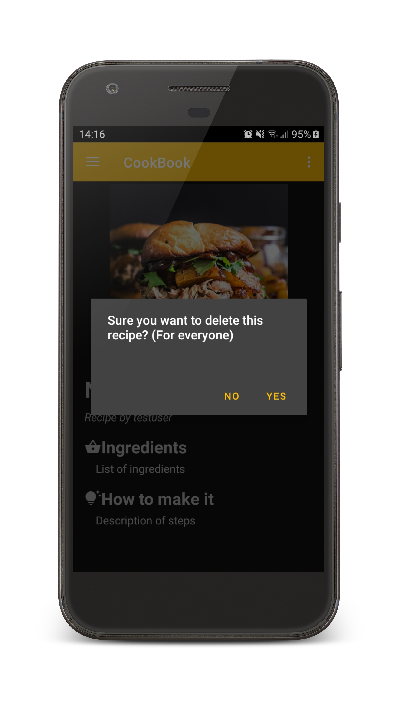
- Push Notification
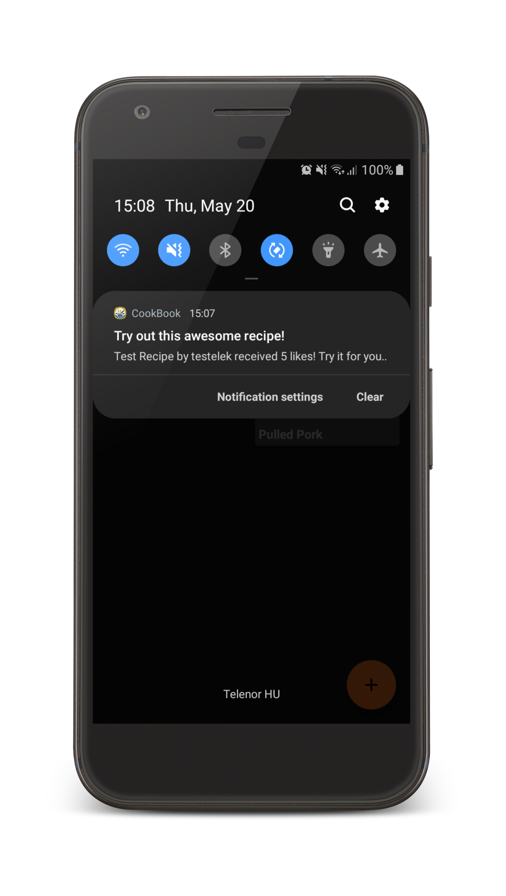